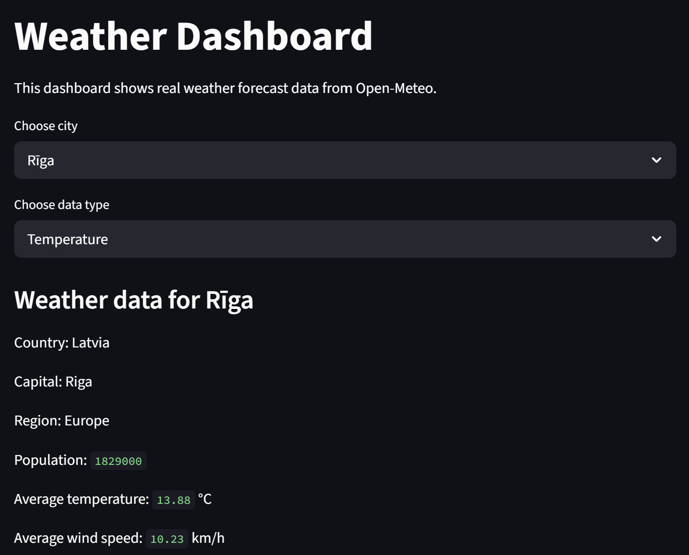

# Weather Dashboard

Weather Dashboard is a Python project that displays real weather forecast data using the Open-Meteo API and Streamlit.

The application allows the user to:
- choose a city
- display temperature or wind speed data
- visualize weather data in charts
- calculate average values
- display additional country information from the REST Countries API

The project was created as a continuation of the previous Weather Simulator project and focuses on:
- software architecture
- API integration
- OOP
- design patterns
- debugging
- refactoring
- testing

---

# Dashboard Preview



---
# Features

## Weather Forecast
The dashboard fetches real weather data from the Open-Meteo API:
- temperature
- wind speed
- time/date

Supported cities:
- Rīga
- Liepāja
- Daugavpils

---

## Data Visualization
The application displays:
- temperature charts
- wind speed charts

Charts are created using matplotlib.

---

## Country Information
Additional information about Latvia is fetched using the REST Countries API:
- country name
- capital city
- region
- population

---

# Technologies Used

- Python
- Streamlit
- matplotlib
- requests
- pytest
- REST API

---

# Project Structure

```text
Weather_Dashboard/
│
├── assets/
│   └── Dashboard.png
├── app.py
├── api_client.py
├── models.py
├── chart_strategy.py
├── tests.py
├── requirements.txt
├── README.md
└── .gitignore
```

---

# File Descriptions

## app.py

Handles:

- Streamlit UI
- city selection
- chart selection
- displaying results

---

## api_client.py

Handles:

- Open-Meteo API requests
- REST Countries API requests
- API error handling

---

## models.py

Contains:

- WeatherData class
- average calculations
- weather data model

---

## chart_strategy.py

Contains:

- Strategy Pattern implementation
- temperature chart strategy
- wind speed chart strategy
- chart strategy selection

---

## tests.py

Contains pytest tests for:

- API data processing
- strategy selection
- invalid chart type
- error situations
- average calculations

---

# OOP Concepts

The project uses:

- classes
- objects
- methods
- inheritance
- polymorphism

Example classes:

- WeatherData
- TemperatureChartStrategy
- WindChartStrategy

---

# Design Pattern

The project uses the Strategy Pattern.

Different chart strategies are used depending on the selected data type:

- TemperatureChartStrategy
- WindChartStrategy

This allows the program to easily support additional chart types in the future.

---

# API Integration

The project uses two REST APIs:

## Open-Meteo API

Used for:

- temperature data
- wind speed data
- weather forecast data

Official website:
https://open-meteo.com/

---

## REST Countries API

Used for:

- country information
- capital city
- region
- population

Official website:
https://restcountries.com/

---

# Testing

The project contains 12 pytest tests.

Tests cover:

- API data processing
- average calculations
- Strategy Pattern selection
- invalid chart types
- error handling
- empty data situations

Run tests:
```bash
pytest tests.py -v
```

---

# Software Engineering Concepts

The project also includes:

- debugging
- refactoring
- legacy code analysis
- software architecture analysis
- testing with pytest

Several improvements were made during refactoring:

- limiting weather data to 24 hours
- improving chart readability
- separating responsibilities into modules
- moving chart strategy selection outside app.py

---

# Installation

## 1. Clone repository

```bash
git clone https://github.com/Andris-Murans/Weather-Dashboard.git
```

---

## 2. Create virtual environment

```bash
python -m venv venv
```

---

## 3. Activate virtual environment

Windows

```bash
venv\Scripts\activate
```

Mac/Linux

```bash
source venv/bin/activate
```

---

## 4. Install dependencies

```bash
pip install -r requirements.txt
```

---

# Running the Application

```bash
streamlit run app.py
```

---

# Running Tests

```bash
pytest tests.py -v
```

---

# Example Dashboard Features

- real-time weather forecast
- chart visualization
- average temperature calculation
- average wind speed calculation
- country information display
- API error handling

---

# Future Improvements

Possible future improvements:

- manual city search
- additional weather data types
- database integration
- forecast comparison
- more chart types
- automatic city geolocation

---

# Author

Andris Murāns